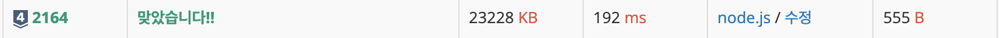
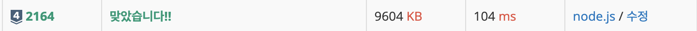

<div> 
  <h1>백준 2164. 카드 2</h1>  
  
</div>

<br>

- **문제 해결 시간** : 2025.07.10
- **생각되는 난이도** : 실버 5
- **한줄 소감** : 좀 더 지혜롭게 코드를 짜자
---

## 1. 문제 정리

### 01. 문제 
N장의 카드가 있다. 각각의 카드는 차례로 1부터 N까지의 번호가 붙어 있으며, 1번 카드가 제일 위에, N번 카드가 제일 아래인 상태로 순서대로 카드가 놓여 있다.

이제 다음과 같은 동작을 카드가 한 장 남을 때까지 반복하게 된다. **우선, 제일 위에 있는 카드를 바닥에 버린다. 그 다음, 제일 위에 있는 카드를 제일 아래에 있는 카드 밑으로 옮긴다.**

예를 들어, N=4인 경우를 생각해 보자. 카드는 제일 위에서부터 1234 의 순서로 놓여있다. 1을 버리면 234가 남는다. 여기서 2를 제일 아래로 옮기면 342가 된다. 3을 버리면 42가 되고, 4를 밑으로 옮기면 24가 된다. 마지막으로 2를 버리고 나면, 남는 카드는 4가 된다.

**N이 주어졌을 때, 제일 마지막에 남게 되는 카드를 구하는 프로그램을 작성하시오.**

### 02. 입력
첫째 줄에 정수 $N(1 ≤ N ≤ 500,000)$이 주어진다.

### 03. 출력
첫째 줄에 남게 되는 카드의 번호를 출력한다.

---
## 2. 문제 접근

### 01. 문제 해결법
- 리스트 길이 $N$이 주어졌을 때, 카드를 처리하는 방식은 다음과 같다
**홀수 번째 요소는 버리고, 짝수 번째 요소는 버리지 않고 남기되, 이때 남긴 요소들을 리스트 뒤에 그대로 이어 붙이는 방식으로 처리한다.** 즉, 원형리스트에서 홀수 번째 인덱스의 요소만 제거해 나가는 방식이라고 볼 수 있다. 이렇게 리스트의 길이가 1이 될때까지 요소들을 제거한다.
<br>

  나는 원형리스트를 구현하는 대신, 좀 더 간단한 방식으로 처리하고자 했다.
  먼저 짝수 인덱스의 요소들만 새로운 리스트에 담는 방식을 선택했다. 그 이유는 JavaScript에서 `shift()` 연산이 $O(N)$의 시간 복잡도를 가지기 때문에, 입력 크기 $N$이 최대 500,000일 경우 시간 초과가 발생할 수 있다고 판단했기 때문이다. 그래서 새로운 배열을 만들어 제거되지 않고 유지될 요소들만 추가하는 방식을 택했다.

  하지만 이 방식은 매 반복마다 짝수 인덱스만 고르는 것처럼 보이지만, 실제로는 회전하면서 요소를 남기는 것이기에, **인덱스 기준이 계속 달라지므로 무조건 짝수 인덱스를 골라서는 안 된다.** 이를 해결하기 위해 `flag`라는 변수를 두고 기존의 리스트와 새로운 리스트의 마지막 요소를 비교한 후, 짝수 인덱스를 삭제할지, 홀수 인덱스를 삭제할지 결정하게 했다.
  
  <br>

  <코드>
  ``` javascript
  const input = fs.readFileSync('BJ2164_input.txt').toString()

  const N = Number(input);

  if (N === 1) {
    console.log(1);
    return;
  }

  let cards = [];
  for (let i = 2; i <= N; i += 2) {
    cards.push(i);
  }

  let flag = N % 2 === 0 ? 1 : 0;

  while (cards.length > 1) {
    const newCards = [];

    for (let i = flag; i < cards.length; i += 2) {
      newCards.push(cards[i]);
    }

    flag = (cards[cards.length - 1] === newCards[newCards.length - 1]) ? 1 : 0;

    cards = newCards;
  }
  console.log(cards[0]);
  ```

  <결과>
  
  <br>
- 지피티의 문제 풀이
  이 문제는 큐를 사용해 시뮬레이션하는 방법 외에도, 수학적 규칙을 활용해 빠르게 정답을 구하는 방식이 존재한다.

  핵심은 마지막에 남는 카드의 번호가 항상 2의 배수이며, 입력값 $N$에 따라 다음과 같은 규칙이 성립한다는 점이다:

  $L =$ $N$ 이하의 가장 큰 2의 거듭제곱 ($2^k$)일 때,
  마지막에 남는 카드는:
  $$ \text{answer} = 2 \times (N - L) $$
  단, $N = L$일 경우에는 정답은 $N$ 자체이다.

  📌 예시
	•	$N = 6$ → $L = 4$ → $\text{answer} = 2 \times (6 - 4) = 4$
	•	$N = 13$ → $L = 8$ → $\text{answer} = 2 \times (13 - 8) = 10$
	•	$N = 16$ → $L = 16$ → $\text{answer} = 16$ (2의 거듭제곱이므로 예외 처리)
  <br>
  이 규칙은 다음과 같은 동작 구조에서 유도된다:
	•	카드가 앞에서 제거되고, 그다음 카드가 뒤로 이동하면서 전체가 원형 구조처럼 회전하게 된다.
	•	처음부터 $2^k$ 장이 있다면, 이 회전은 완전히 균형 있게 일어나기 때문에 마지막 카드가 무조건 $N$이다.
	•	$N$이 $2^k$보다 클 경우, 남는 $(N - L)$ 장의 카드가 뒤로 계속 밀리며,
최종적으로 $2 \times (N - L)$ 위치의 카드가 마지막에 남게 된다.
<br>

  <코드>
  ```javascript
  const input = Number(require('fs').readFileSync('/dev/stdin').toString());

  let L = 1;
  while (L * 2 <= input) {
    L *= 2;
  }

  const result = 2 * (input - L);
  console.log(result === 0 ? input : result);
  ```
  
  L은 $N$ 이하의 가장 큰 2의 거듭제곱이고,
N - L은 살아남은 카드가 몇 번째로 회전했는지를 의미한다.
이 값을 2배 해주면 최종적으로 살아남는 카드의 숫자를 알 수 있다.
  <br>
  <결과>
  

## 3. 회고
지피티가 짜준 코드를 보면서 내가 그동안 규칙을 찾는 것보다, 구현하는데에만 초점을 두고 알고리즘을 짰다는 생각이 들었다. 좀 더 간결하게 코드를 작성할 수 있는데, 구현에 초점을 맞추다보니까 점점 길어지고, 복잡해지는 것을 느꼈다. 
쉽진 않겠지만, 앞으로는 종이에다 써보면서 규칙을 찾고, 구현하는 습관을 들여야겠다.
