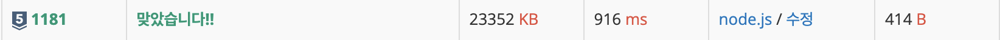
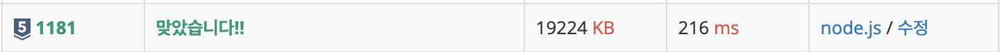
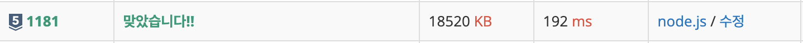

<div> 
  <h1>백준 1181. 단어 정렬</h1>  
  
</div>

<br>

- **문제 해결 시간** : 2025.07.11
- **생각되는 난이도** : 실버 5
- **한줄 소감** : 
---

## 1. 문제 정리

### 01. 문제 
**알파벳 소문자로 이루어진 N개의 단어가 들어오면 아래와 같은 조건에 따라 정렬하는 프로그램을 작성하시오.**

길이가 짧은 것부터
길이가 같으면 사전 순으로
단, 중복된 단어는 하나만 남기고 제거해야 한다.

**N이 주어졌을 때, 제일 마지막에 남게 되는 카드를 구하는 프로그램을 작성하시오.**

### 02. 입력
첫째 줄에 단어의 개수 `N`이 주어진다. $(1 ≤ N ≤ 20,000)$ 
둘째 줄부터 N개의 줄에 걸쳐 알파벳 소문자로 이루어진 단어가 한 줄에 하나씩 주어진다. 주어지는 문자열의 길이는 50을 넘지 않는다.

### 03. 출력
조건에 따라 정렬하여 단어들을 출력한다.

---
## 2. 문제 접근

### 01. 문제 접근 방식
우선 `sort`메서드를 사용하여 단어들을 정렬한다. 정렬 기준은 단어의 길이가 짧은 순이며, 길이가 같은 경우는 사전순으로 정렬한다.
그 다음, 중복 요소를 제거하기 위해 `Set`에 담고, 이를 다시 배열로 반환해서 처리하였다. 배열로 다시 변환한 이유는 직접 Set을 for문으로 순회할 경우 시간 복잡도 측면에서 비효율적이라는 점을 발견했기 때문이다. 그렇기에 배열로 변환한 뒤 `join()` 메서드를 사용하여 하나의 문자열로 만들어 출력하는 방식을 선택했다.

<Set을 직접 for문으로 돌리기>



### 02. 풀이법
단어를 정렬하는 과정에서 두 가지 방법을 구현해보았다.
둘 다 기본적으로 단어 길이를 기준으로 오름차순 정렬하고, 길이가 같을 경우엔 사전 순으로 정렬하지만, 구현하는 방식이 조금 다르다.

**1. localeCompare() 메소드 사용**
**`a.localeCompare(b)`**: 길이가 같을 경우, 유니코드/언어 설정을 고려한 정확한 사전순 정렬
	**localeCompare**는 언어별 특수 문자나 대소문자 정렬 등에서도 정밀한 정렬을 지원한다.

<<<<<<< Updated upstream
```javascript
    const wordList = [... new Set(input.splice(1).sort((a, b) => a.length - b.length || a.localeCompare(b)))].join("\n")
```
=======
  ```javascript
    const wordList = [... new Set(input.splice(1).sort((a, b) => a.length - b.length || a.localeCompare(b)))].join("\n")
   ```
>>>>>>> Stashed changes

  


**2. if 문으로 사용해서 정렬**
  단순 if문을 `sort()` 안에 사용해서 정렬했다.

  ```javascript
  const wordList = [ ... new Set(input.splice(1).sort((a, b) => {
    if (a.length === b.length) return a < b? -1 : 1
    return a.length - b.length
    })
  )].join("\n")

  ```
  


-> `localeCompare()`를 사용하는 것보다 `if문`을 사용하는 것이 훨씬 빨랐다. 아마 localeCompare()는 다양한 언어를 지원하다 보니, 추가적인 기능들이 있어서 무겁나 보다.

## 3. 회고
이번 기회에 `localeCompare()`라는 메소드랑 `sort()`의 심층적인 사용법을 익힐 수 있었다. 조금씩 자바스크립트가 익숙해지는 것 같지만, 아직 갈 길이 멀었다.
알고리즘을 풀면서 자바스크립트에 익숙해지는 것도 좋지만, 자바스크립트 자체에 대해 공부하는 것도 중요하다는 생각이 들었다. 자바스크립트 공부도 같이 병행해야겠다.
