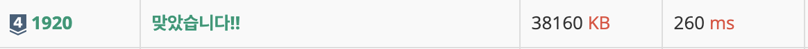

<div> 
  <h1>백준 1181. 단어 정렬</h1>  
  
</div>

<br>

- **문제 해결 시간** : 2025.07.15
- **생각되는 난이도** : 실버 4
- **한줄 소감** : console.log를 잘 쓰자
---

## 1. 문제 정리

### 01. 문제 
N개의 정수 A[1], A[2], …, A[N]이 주어져 있을 때, 이 안에 X라는 정수가 존재하는지 알아내는 프로그램을 작성하시오.

### 02. 입력
첫째 줄에 자연수 N(1 ≤ N ≤ 100,000)이 주어진다. 
다음 줄에는 N개의 정수 A[1], A[2], …, A[N]이 주어진다. 
다음 줄에는 M(1 ≤ M ≤ 100,000)이 주어진다. 
다음 줄에는 M개의 수들이 주어지는데, 이 수들이 A안에 존재하는지 알아내면 된다. 모든 정수의 범위는 -231 보다 크거나 같고 231보다 작다.

### 03. 출력
M개의 줄에 답을 출력한다. 존재하면 1을, 존재하지 않으면 0을 출력한다

---
## 2. 문제 접근
A를 `Set`으로 생성한다. `Set`은 탐색에서 **O(1)** 만큼 걸리기 때문에 해당 알고리즘의 탐색 비용을 획기적으로 줄일 것이라 예상된다. 이후 for 문을 사용하여 `num_lst`(검사해야하는 정수들을 담은 리스트)의 요소들이 A에 있는지 탐색한다. 


## 3. 회고 
처음애는 반복문 안에서 조건을 비교한 후 바로 `console.log()`를 출력하는 방식으로 코드를 작성했다.
```javascript
for ( let i = 0; i < M ; i ++ ) {
  if (A.has(num_lst[i])) console.log(1)
  else console.log(0)
}
```

이유를 찾아보니 `console.log()`가 생각보다 비용이 큰 작업이라는 것을 알게 되었다. 그래서 개선된 방식으로, 결과를 `result` 배열에 먼저 저장한 후, 마지막에 `console.log()`를 한 번만 호출해 출력하도록 수정했다.
```javascript
const result = new Array(M);

for (let i = 0; i < M; i++) {
  result[i] = A.has(num_lst[i]) ? 1 : 0;
}

console.log(result.join("\n"));
```


수정 후 실행 시간은 기존 대비 5배 이상 단축되었다.
앞으로는 반복문 안에서 바로 출력하지 않고, 결과를 모아서 한 번에 출력하는 방식을 기본 전략으로 가져가야겠다고 느꼈다.
